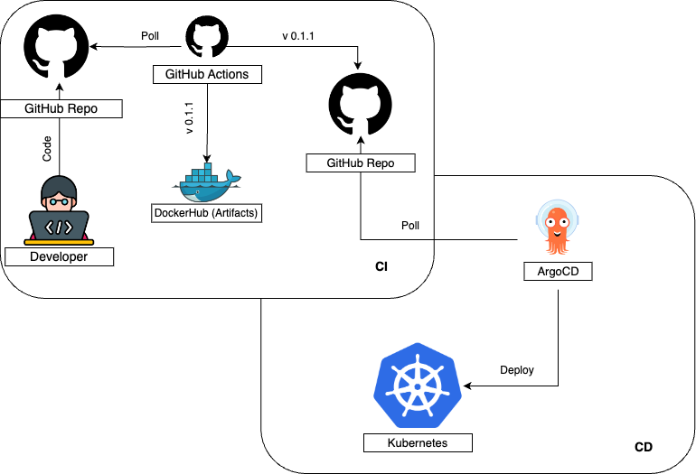

# Deploying CI with GitHub Actions

**This project demonstrates the integration of GitHub Actions with ArgoCD to automate the deployment of applications to Kubernetes clusters. It focuses on setting up a CI/CD pipeline that leverages GitHub Actions for continuous integration and ArgoCD for continuous delivery.**

**Architecture:**

The repository utilizes GitHub Actions for automating CI workflows, including managing secrets securely, ArgoCD for continuous delivery and application synchronization in Kubernetes, Kubernetes for orchestrating containerized applications, Helm for managing Kubernetes applications with charts, Docker with multi-stage builds for optimizing container images, and YAML for defining configurations and workflows.